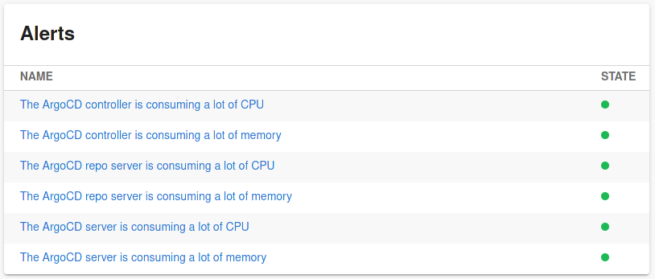
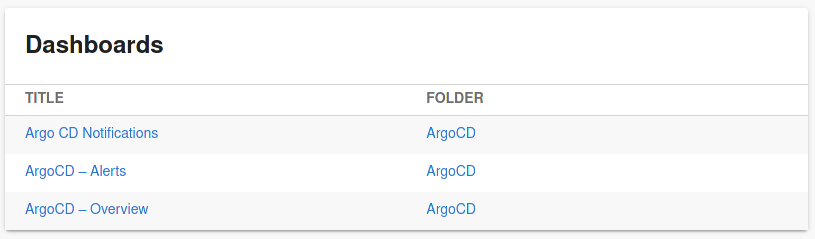

# Grafana plugin for Backstage

Welcome to the Grafana plugin!

Service alerts card:


Service dashboards card:


## Plugin Setup

1. If you have standalone app (you didn't clone this repository), then do:

```bash
yarn add @k-phoen/backstage-plugin-grafana
```

2. Configure the plugin:

```yaml
proxy:
  '/grafana/api':
    # May be an internal DNS
    target: https://grafana.host/
    headers:
      Authorization: ${GRAFANA_TOKEN}

grafana:
  # Publicly accessible domain
  domain: https://monitoring.company.com
```

**Note:** the `GRAFANA_TOKEN` environment variable follows the `Bearer [API KEY]` pattern.

3. Expose the plugin to your Backstage instance:

```ts
// packages/app/src/plugins.tsx

// other plugins

export { grafanaPlugin } from '@k-phoen/backstage-plugin-grafana';
```

4. Add it to the `EntityPage.tsx`:

```ts
import {
  EntityGrafanaAlertsCard,
  EntityGrafanaDashboardsCard,
} from '@k-phoen/backstage-plugin-grafana';

// add wherever you want to display the dashboards and alerts card:
<Grid container>
  <Grid item md={6}>
    <EntityGrafanaDashboardsCard />
  </Grid>

  <Grid item md={6}>
    <EntityGrafanaAlertsCard />
  </Grid>
</Grid>
```

## Component configuration

Add an annotation to the YAML config file of a component.

```yaml
apiVersion: backstage.io/v1alpha1
kind: Component
metadata:
  name: example
  annotations:
    grafana/tag-selector: <tag>
```

This plugin will then display dashboards and alerts matching the given tag.

## License

This library is under the [Apache 2.0](LICENSE) license.